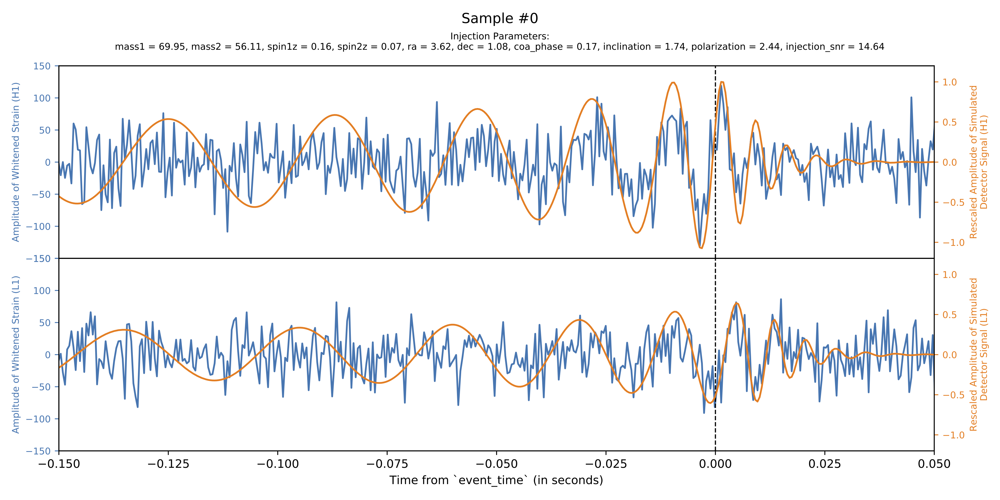
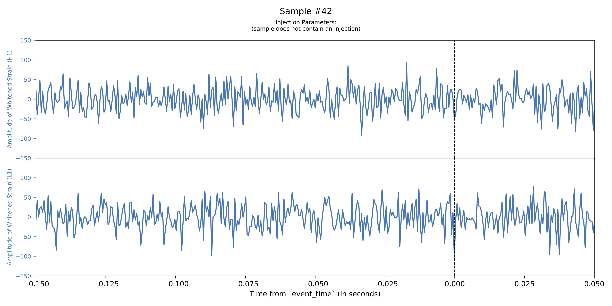

# generate-gw-data

The purpose of this repository is to provide a starting point for generating—more of less—realistic samples of synthetic gravitational wave (GW) data which can be used, e.g., for machine learning experiments. By "samples", we mean time series data, which either does or does not contain a GW waveform. Since the latter have to be simulated, only samples with signals from gravitational waves originating from binary mergers can be created.

In short (for details, see below), the main idea behind the data generating process is the following: 

1. Randomly select a piece of real LIGO recording to serve as background noise, 
2. Randomly select the parameters of a compact binary coalescence (CBC) from a given parameter space and simulate the corresponding waveform,
3. Add ("inject") this simulated waveform into the background noise.

The scripts in this repository are essentially just a convenience wrapper around the [PyCBC software package](https://pycbc.org/), which itself relies partly on the [LIGO Algorithm Library (LAL)](https://wiki.ligo.org/Computing/DASWG/LALSuite). 


## 1. Getting Started

In this section, we describe the necessary steps to get the scripts running and to generate your first samples (don't worry, it's not that complicated!). More details on sample generation process can be found in the sections below. But now let's get started:

### 1.1 Setting up the environment

In order to be able to run the scripts in this repository, you need to make sure you have the necessary packages installed. If you are using `pip` to manage your Python installation, you can simply run:

```
pip install -r requirements.txt
```

We would advise you to install these packages in a new, separate *virtual environment*. If you don't know how to do that, maybe check out the [tutorial on virtualenv on the Hitchhiker's Guide to Python](https://docs.python-guide.org/dev/virtualenvs/#lower-level-virtualenv.).

**Please note:** Since `pycbc` is only available for Python 2.7 (apparently due to some hard-to-migrate dependencies), all code in this repository is written only for Python 2.7 — sorry about that!

### 1.2 Downloading the LIGO recordings

As a next step, you will need to download the LIGO recordings, which will be used for the background noise from the [LIGO Open Science Center (LOSC)](https://www.gw-openscience.org/archive/O1/). We recommend you to download the data at a sampling frequency of 4096 Hz. As the file format, choose HDF5. LOSC also has [a tutorial on downloading data](https://www.gw-openscience.org/tutorial01/), which is a bit out of date, but may be still of use.

To help you get started with the batch download, the `scripts` directory contains a script `download_losc_data.py`, which you can use as follows:

```shell
python download_losc_data.py --destination=/path/to/download/folder
```

At the time of writing of this guide, only the data for Observation Run 1 (O1) has been released to the public. Some of the default values of the download script (e.g., the start and end time stamps) are also based on O1. However, unless the file format is changed significantly for future releases, most of this code should be reusable for O2 with only minor edits.

The download script will automatically create folders for the two detectors  `H1` and `L1` in the specified target directory, and will sort the files accordingly. Due to different downtimes for the detectors, the number of HDF files ending up in these two directories is *not* expected to be the same!

Note that `download_losc_data.py` also has a `--dry` option, in case you want to check what the script *would* download without actually downloading anything yet. Furthermore, if you are actually interested in what is inside such an HDF file, you may want to take a look at the [What's in a LIGO data file?](https://www.gw-openscience.org/tutorial02/) tutorial on LOSC, which explains the internal structure of these files and how to extract data yourself. 

**Finally, a word of warning:** The full LIGO recordings for O1 are about ~361 GB worth of HDF files, so be sure you have enough storage! Also, depending on your internet connection, the download will probably take several hours.

### 1.3 Creating your first samples

Once you have set up the Python environment and downloaded the raw LIGO files, you can start doing what is the main purpose of this repository: Create your own artificial gravitational wave data!

To this end, check out the `config_files` directory. In there, you will find two different types of configuration files (see below for a more detailed explanation of the parameters you can configure here!):

* `*.json` files: These files steer the sample generation process itself. Here, you can control how many data samples you want to create, how many cores to use for it, which background data to use, et cetera.
  To get started, all you need to do is open the `default.json` file and adjust the `background_data_directory` path to the location to which you downloaded the HDF files in step 1.2.
* `*.ini` files: These files mainly control the process of simulating GW waveforms with PyCBC. Here, you can choose the *waveform approximant* (i.e., the model used for the simulation) or define the parameter space for the mergers (e.g., the masses of the colliding black holes / neutron stars). However, this is also the place where you control the length (in seconds) of the samples that you are generating.
  If you don't (yet) know what all these things mean, you can simply leave the `waveform_params.ini` file untouched for now.

Once you've decided on your configuration (again, to get started, all you really need to do is fix the `background_data_directory ` value in `default.json`!), we are ready to generate the first sample. To do this, switch to the `scripts` directory and run the following:

```shell
python generate_sample.py --config-file=default.json
```

Depending how many samples your are creating (specified in the `*.json` file), this now may take a while. The resulting sample file should eventually be stored in the `output` directory.

Some experience values for reference: Generating 32 samples *with* an injection, and 16 samples *without* an injection (using 4 processes in parallel) took about ~250 seconds on our machine. A significant part of this time, however, is an overhead that is needed for reading in and analyzing the background data in order to find the times from which a valid piece of noise can be selected (see below).

### 1.4 Inspecting the generated samples

As soon as the sample generation process is complete, you can manually inspect the results to get a feel for what they look like. To this end, we have prepared the script `view_samples.py` in the `scripts` directory. You can run it as follows:

```shell
python view_samples.py --hdf-file-path=/path/to/hdf/sample/file --sample-id=N --save-plot=/where/to/save/the/result/plot
```

If you haven't changed the configuration, you don't even need to specify the `--hdf-file-path` option; per default it will use `./output/default.hdf`. 

The `--sample-id` refers to the sample you want to plot. This should be an integer between 0 and `n_injection_samples` + `n_noise_samples`, as specified in the `*.json` configuration file: 
If you choose a value between 0 and `n_injection_samples`, you will get a sample containing an injection; if you choose one between `n_injection_samples` and `n_injection_samples` + `n_noise_samples`, you will get a sample that does not contain an injection (i.e., that is just whitened background noise).

Finally, you should specify the location where you want to store the resulting plot using the `--save-plot` flag. Note that you can always learn more about the possible command line options by running `python view_sample.py —help`.

If everything worked as expected, you should get a result plot that looks something like the following:



*Heureka!* It looks like a gravitational wave! In blue, you can see the whitened strain, that is, the result from adding a simulated signal into real noise and then *whitening* the result. In orange, you can see the raw simulated signal before adding it into the background noise. It has been rescaled to an arbitrary scale to allow a better comparison with the blue curve. We do not expect a perfect match here!

Note also how the detector signal (in orange) is *different* for the two detector (upper and lower panel). This is because the relative position and orientation of the two detectors causes the signal to be detected with a different phase and amplitude, depending on the position of the source in the sky. This dependency is described by the *antenna patterns* of the interferometer — just one of the subleties of generating realistic GW data that the scripts in this repository are taking care of :)

Finally, if you run the `view_sample.py` script for a sample that does not contain an injection, you will of course only get the whitened strain, but not detector signals:



This is it! Now you should know how to use the tools in this repository to generate your own synthetic GW data, combining real LIGO recordings with simulated waveforms to make injections. Keep on reading to learn more about the details of the process and how you can customize things to suit your needs.